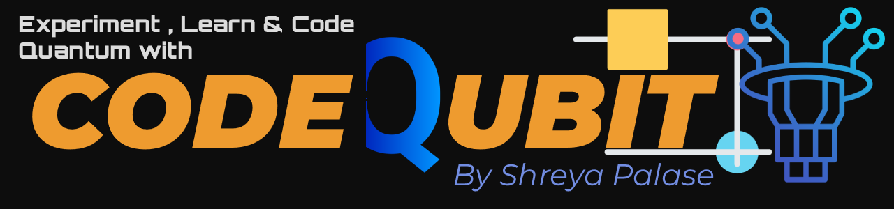

# ⚛️ Quantum Computing Coding 
### Learn, Practice, and Implement Quantum Algorithms with Real Code

Welcome to **Quantum Computing Coding**, a complete repository for students, developers, and researchers who want to learn and implement quantum algorithms from scratch using Python-based frameworks **Qiskit**.

This repository provides:
- Quantum algorithm implementations  
- Jupyter notebooks for interactive practice  
- Detailed theory notes  
- Hands-on coding exercises  
- Clear folder structure for easy learning and collaboration  

---

## 📌 About This Repository

This repository is designed to help you:

- Learn the fundamentals of quantum computing  
- Practice coding quantum algorithms  
- Understand how quantum circuits work  
- Run simulations and real quantum hardware  
- Prepare for exams, interviews, and research projects  
- Collaborate with the open-source quantum computing community  

---

## 📚 Quantum Algorithms Covered

The repository includes the following algorithms:

- **Deutsch–Jozsa Algorithm**  
- **Grover’s Search Algorithm**  
- **Variational Quantum Eigensolver (VQE)**  
- **Quantum Approximate Optimization Algorithm (QAOA)**  
- **Quantum Phase Estimation (QPE)**  

Each algorithm includes:

- Python implementation  
- Notebook tutorial  
- Theory notes  
- Step-by-step explanations  

---

## Install Dependencies

Install the quantum frameworks of your choice,in this we work with:

Qiskit

pip install qiskit

---

## Running Code

Open Jupyter Notebook:
jupyter notebook notebooks/grover.ipynb

---

## Documentation

All quantum concepts And algorithm theory notes related with qiskit implemtation of each code are included  in:
'dayNo_Topic/dayNo_notes.md' like this format file according to topic, inside each topic folder.
It includes:
- Algorithm theory and purpose
- Prerequisites
- Circuit design and explanation
- Mathematical intuition

---

## Skills You Will Gain
By working with this repository, you will learn:
- Quantum circuit design and implementation
- Superposition, entanglement, and measurement
- Building and running quantum algorithms
- Hybrid quantum-classical methods (VQE/QAOA)
- Quantum simulation and real backend execution
- Python coding skills for quantum computing

---

## Goals of This Project
- Provide a hands-on, beginner-to-advanced quantum computing learning resource
- Help students and professionals practice and implement algorithms
- Create an open-source, collaborative environment for quantum learning
- Encourage contributions and knowledge sharing in the quantum community

---

## Contributing
Contributions are highly welcome! You can contribute by:
- Adding new quantum algorithms or examples
- Improving code structure or style
- Writing Jupyter notebooks for tutorials
- Fixing bugs or typos
- Improving documentation
- Adding diagrams or visualizations
  
Please see CONTRIBUTING.md for detailed guidelines.

---

#Support & Help
If you need help:
- GitHub Issues → Report bugs or ask questions
- GitHub Discussions → Ask conceptual or practical questions
- Contact Maintainer → via GitHub profile
  
See SUPPORT.md for complete instructions.

---

## ⭐ Support This Project
If this repository helps you:
- Give it a Star ⭐ on GitHub
- Share it with friends, classmates, or communities
- Collaborate and submit pull requests
- Your support helps grow the repository and the quantum learning community!

---

## 📝 License
This project is released under the MIT License, allowing free use, modification, and distribution with proper attribution.

---

## 👤 Author / Maintainer

**Name:** Shreya Sunil Palase  
**GitHub:** [@shreyapalase](https://github.com/shreyapalase)  

You are welcome to reach out for:

- Questions about this repository  
- Collaboration opportunities  
- Suggestions for new content  
- Feedback and contributions  

---

## ✨ Thank You!
Your interest, contributions, and support help make quantum learning accessible to everyone.
Together, we can learn, code, and explore the world of quantum computing—one qubit at a time!

Thank you for visiting **Quantum Computing Coding**!  

### — **SHREYA PALASE**(Creator of Quantum Computing Coding)
